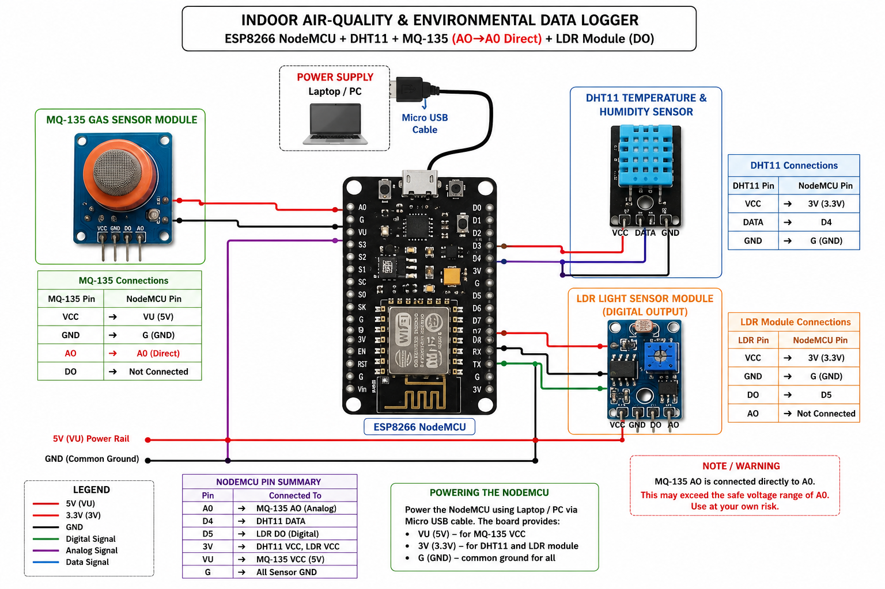
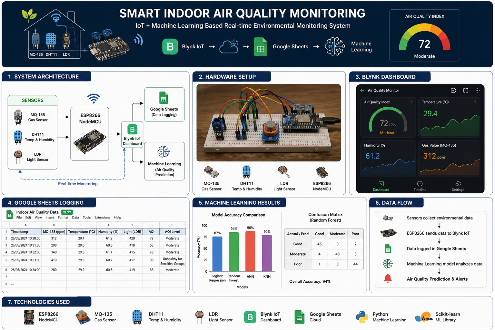

# 🌍 Smart Indoor Air Quality Monitoring using IoT & Machine Learning

> A real-time Indoor Air Quality Monitoring System built using **ESP8266 NodeMCU**, **MQ-135**, **DHT11**, and **LDR** sensors. The system monitors environmental conditions, sends live data to **Blynk IoT**, stores historical data in **Google Sheets**, and applies **Machine Learning** for air quality prediction and analysis.

---

## 📖 Project Overview

Indoor air pollution can negatively impact health and productivity. This project continuously monitors important environmental parameters and provides real-time visualization and cloud-based logging. The collected data can be used to train Machine Learning models for predicting air quality and occupancy status.

---

## 🎯 Objectives

- Monitor indoor air quality in real time.
- Measure gas concentration, temperature, humidity, and light intensity.
- Display sensor data on a Blynk IoT dashboard.
- Store environmental data automatically in Google Sheets.
- Apply Machine Learning algorithms for air quality prediction.
- Create a scalable IoT-based environmental monitoring solution.

---

# ⚙️ Hardware Components

| Component | Purpose |
|-----------|----------|
| ESP8266 NodeMCU | Main Microcontroller |
| MQ-135 Gas Sensor | Air Quality Monitoring |
| DHT11 | Temperature & Humidity |
| LDR | Light Intensity |
| Breadboard | Circuit Connections |
| Jumper Wires | Wiring |

---

# 📷 Circuit Diagram

## Hardware Setup



---

# 💻 Software & Technologies

- Arduino IDE
- ESP8266
- Blynk IoT
- Google Sheets API
- Python
- Google Colab
- Scikit-learn
- Pandas
- NumPy
- Matplotlib

---

# 🚀 Features

✅ Real-time Indoor Air Quality Monitoring

✅ Cloud Dashboard using Blynk IoT

✅ Automatic Google Sheets Data Logging

✅ Machine Learning Analysis

✅ Temperature Monitoring

✅ Humidity Monitoring

✅ Light Intensity Detection

✅ Gas Concentration Monitoring

✅ Occupancy Detection

---

# 📂 Repository Structure

```
Smart-Indoor-Air-Quality-Monitoring
│
├── Code/
│   ├── ESP8266/
│   └── Machine_Learning/
│
├── Circuit_Diagram/
│
├── Dataset/
│
├── Images/
│
├── Presentation/
│
├── Report/
│
├── README.md
├── LICENSE
└── .gitignore
```

---

# 📊 Machine Learning Models Used

The collected environmental dataset was used to evaluate different Machine Learning algorithms.

- Logistic Regression
- Random Forest
- Artificial Neural Network (ANN)
- K-Nearest Neighbors (KNN)

The objective was to classify indoor environmental conditions and compare the performance of different models.

---

# 🔄 System Workflow

```
Sensors
      │
      ▼
ESP8266 NodeMCU
      │
      ▼
Blynk IoT Dashboard
      │
      ▼
Google Sheets
      │
      ▼
Machine Learning Model
      │
      ▼
Air Quality Prediction
```

---

# 📈 Results

The system successfully

- Collected environmental data in real time.
- Displayed live readings using Blynk IoT.
- Logged sensor readings to Google Sheets.
- Generated datasets suitable for Machine Learning.
- Demonstrated accurate prediction using multiple ML algorithms.

---

# 🖼️ Project Overview


---

# 📁 Dataset

The dataset contains

- Gas Concentration
- Temperature
- Humidity
- Light Intensity
- Timestamp
- Occupancy Status

---

# ▶️ How to Run

### Hardware

1. Connect MQ135, DHT11 and LDR to ESP8266.
2. Upload the Arduino sketch.
3. Connect ESP8266 to Wi-Fi.
4. Open Blynk Dashboard.

### Machine Learning

1. Open Google Colab Notebook.
2. Load Dataset.
3. Train ML Models.
4. Evaluate Results.
5. Predict Air Quality.

---

# 🔮 Future Improvements

- TinyML deployment on ESP32
- Mobile application
- SMS & Email Alerts
- AQI Classification
- Cloud Database Integration
- OLED Display
- Battery Backup
- Voice Assistant Integration

---

# 👨‍💻 Author

**Bishnujyoti Gogoi**

B.Tech Electronics & Telecommunication Engineering

Jorhat Institute of Science & Technology

GitHub:
https://github.com/bishnujyoti-gogoi

LinkedIn:
https://www.linkedin.com/in/bishnujyoti-gogoi-24b908247/

---

# 📜 License

This project is licensed under the MIT License.
